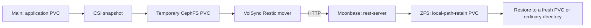

# Main CephFS to Moonbase backup plan

Status (2026-09-26): implementation in progress. Jackett's first backup
completed successfully. The Plex, Sonarr, Radarr, and Lidarr policies are in
Git and passed server-side validation, but their live backups have not been
verified. No restore has been tested.

VolSync runs on main and the REST server runs on Moonbase. The REST server uses
`local-path-retain` under `/tank/local-path-provisioner`; see its
[setup notes](../kubernetes/argocd/moonbase/manifests/rest-server/README.md).
Its internal HTTP endpoint currently has no REST authentication. The shared
Restic repository encryption password lives in the private main-cluster secret
store and is delivered to each application namespace by an ExternalSecret.

## Recommendation

Use VolSync's Restic mover in **main** to back up individual application PVCs
to a Restic REST server on **Moonbase**, with repositories stored on Moonbase's
ZFS storage. Use CSI snapshots for the dynamic CephFS PVCs, subject to a pilot
that measures clone cost and verifies application recovery.

Keep Backrest for existing backups and potentially for browsing the new Restic
repositories. Give each repository one owner for retention and pruning.
Handle shared CephFS directories separately so the migration does not silently
drop home files, media, or other data outside application PVCs.



VolSync uses `ReplicationSource` for Restic backups and
`ReplicationDestination` for restores. Moonbase only needs to host the repository
service for normal backups; a VolSync installation there is needed only if it
will perform Kubernetes restores. This is supported by the
[VolSync Restic documentation](https://volsync.readthedocs.io/en/stable/usage/restic/index.html).

## What exists today

Repository inspection and read-only Kubernetes queries established:

- [Backrest deployment](../kubernetes/argocd/moonbase/manifests/backrest/backrest.deployment.yaml)
  mounts `ceph-nfs.home:/cephfs` at `/userdata` and `/tank/backups` at `/repos`.
  The source NFS mount is not declared read-only. Backrest configuration resides
  at `/data/config.json` on its PVC, so actual plans and exclusions are not
  described in this repository. Its live pod is running; backup success and
  restore quality have not been verified.
- Main has **14 dynamic CephFS PVCs**, using `rook-cephfs` or
  `rook-cephfs-retain`; none of the currently bound PVCs uses RBD.
- Main already runs `rke2-snapshot-controller` and has
  `csi-cephfsplugin-snapclass`, with driver
  `rook-ceph.cephfs.csi.ceph.com` and snapshot deletion policy `Delete`.
  Their presence does not prove an end-to-end snapshot restore works.
- Moonbase has `local-path` and `local-path-retain` StorageClasses. Its
  [provisioner manifest](../kubernetes/argocd/moonbase/apps/localpath-provisioner.app.yaml)
  stores data under `/tank/local-path-provisioner`; the
  [Moonbase design](moonbase.readme.md) explicitly chooses ZFS for recovery
  without Kubernetes. ZFS health, available capacity, and dataset boundaries
  still need verification.
- Jackett's first run created a ready CephFS snapshot and disposable PVC,
  initialized its repository on Moonbase, and saved Restic snapshot `4be215b0`.
  The successful transfer processed 65 files (24.918 MiB) in about five
  seconds. The source snapshot and temporary PVC were cleaned up; the Restic
  cache PVC remains for later runs. Initial DNS failures extended the overall
  operation to about 17 minutes; the `restic.moonbase.home` record was then
  added and the backup succeeded.
- Samba's `samba-cephfs` is an additional **static** PVC mounting CephFS `/`.
  The [Samba configuration](../kubernetes/argocd/main-cluster/manifests/samba/README.md)
  exposes `/home`, `/media`, and `/backups`. Several apps also mount media
  directories directly through NFS.

The earlier [VolSync draft](../tasks/volsync-plan.task.md) describes rsync-based
standby replication and assumes RBD on both clusters. That architecture and its
placeholder manifests should not be used for this backup deployment. This plan
preserves that draft and provides an alternative based on the current inventory.

## Alternatives and trade-offs

| Approach | Fit here | Main trade-off |
| --- | --- | --- |
| Backrest reads the live NFS export | Retain during migration; useful for broad file coverage | Depends on the NFS gateway and reads files while they change; PVC restore mapping and app consistency need separate handling. |
| VolSync + Restic + REST server on ZFS | Recommended for app PVCs | Declarative policies and independent backup history; adds a controller and temporary-volume I/O. |
| VolSync + Restic + S3 service on Moonbase | Valid alternative if object storage is also needed | Adds an object-storage service; REST is a smaller addition to the existing directory-based destination. |
| VolSync rsync-TLS to Moonbase PVCs | Optional later for faster app recovery | A current replica needs separate historical retention to survive propagated deletion or corruption. |
| Ceph-native mirroring | Poor match to this destination | CephFS mirroring requires a remote CephFS; Moonbase currently uses ZFS/local-path. |
| Velero with data movement | Consider if Kubernetes object backup becomes a requirement | Broader restore scope, with additional backup infrastructure; Git already describes much of the desired app state. |

These judgments follow the documented roles of
[VolSync's movers](https://volsync.readthedocs.io/en/stable/usage/index.html),
[Restic REST server](https://github.com/restic/rest-server),
[CephFS mirroring](https://docs.ceph.com/en/latest/cephfs/cephfs-mirroring/), and
[Velero CSI data movement](https://velero.io/docs/main/csi-snapshot-data-movement/).
Local Ceph snapshots alone do not provide a copy that survives losing main's
Ceph storage. ZFS replication cannot directly send a CephFS source dataset.

## Coverage and consistency

Current and proposed coverage, to be adjusted after measuring actual used
bytes, change rate, and restore time:

| Data | Current treatment |
| --- | --- |
| `jackett-config` | First backup verified; six-hourly policy is in Git. |
| `plex-config`, `sonarr-config`, `radarr-config`, `lidarr-config` | Six-hourly policies are in Git and passed server-side dry-run; confirm their first live backups and cleanup. |
| `bitwarden-config`, `home-assistant-config`, `pig-ebank-storage`, `mqtt-config` | Prioritize recovery testing; target hourly backups if clone cost permits. |
| `bazarr-config`, `qbittorrent-appdata`, `samba-state`, `soulseek-appdata`, `tunarr-config` | Candidates for staggered six-hourly backups after the current set is verified. |
| Shared `/home`, selected `/backups`, irreplaceable media | Maintain current coverage until an explicit directory inventory and replacement restore test pass. |
| Download staging, caches, replaceable media | Make inclusion/exclusion explicit after assessing size and recovery value. |

A schedule is a target recovery-point interval, not a guarantee: completion time
and failed runs increase potential data loss. Record measured restore times
before committing to a recovery-time objective.

Snapshots of running apps provide a filesystem point in time; they do not
automatically flush application buffers or coordinate multiple PVCs. For each
database-bearing app, document and test its supported backup/export operation,
an online database backup, or a brief write pause/clean shutdown around snapshot
creation. Resume writes once the snapshot is ready, without waiting for the
network upload. Keep related database files, journals, and attachments coherent.
Do not treat a copied live database file as a tested database backup.

CephFS cloning copies snapshot data into a new subvolume and can be expensive for
large volumes or many files. Benchmark snapshot-to-mounted-PVC time, total job
time, and Ceph space/I/O overhead, especially for Plex and Home Assistant.
[Ceph documents the bulk-copy behavior](https://docs.ceph.com/en/latest/cephfs/fs-volumes/#cloning-snapshots).

The static Samba root mount cannot use the same snapshot workflow:
[Ceph CSI does not support snapshot/clone operations on static PVCs](https://github.com/ceph/ceph-csi/blob/devel/docs/static-pvc.md).
For shared directories, the preferred follow-up is a backup job in main that
reads a native CephFS directory snapshot through a restricted CephFS mount and
sends Restic data to Moonbase. Snapshot creation/cleanup needs its own scoped
permissions and automation. A direct live-file copy remains a fallback with
weaker consistency. Avoid backing up the entire root once per app, including
CSI temporary clones or duplicate subvolume data.

## Implementation phases

### 1. Inventory and establish recovery requirements

- Export only the non-secret parts of Backrest plans: source paths, exclusions,
  repository identifiers, schedules, retention, and recent successful runs.
- Map every PVC and shared directory to an owner, used size, consistency method,
  backup policy, and restore procedure. Include external databases if discovered.
- Verify Moonbase ZFS health/free space, available network throughput, and
  existing repository sizes. Size for first backups, retained changes, pruning
  workspace, and ZFS snapshots; PVC requested capacity is not used-byte size.
- Preserve the shared Restic repository password in the private Git secret
  repository and ensure that repository remains accessible during disaster
  recovery. The REST server currently has no separate authentication password.

### 2. Add Moonbase repository hosting

- Verify that the existing `local-path-retain` directory under
  `/tank/local-path-provisioner` is on the intended ZFS dataset. Record the
  bound PV path for host-level recovery. Do not move or reinitialize Backrest
  repositories.
- Deploy a pinned `restic/rest-server` release with one replica, reachable over
  the internal HTTP network from main. It currently runs without REST-server
  authentication by explicit choice; restrict the ingress to the private network
  and do not publish it externally. Verify DNS, upload limits, and timeouts from
  a mover pod.
- Use a retained `local-path-retain` PVC with ArgoCD prune protection for durable
  repository storage. Require the ZFS mount to be present before the server
  starts, so a missing pool cannot redirect writes to the host root filesystem.
- Give each PVC a separate repository, for example `/data/jackett-config`.
  Each repository configuration Secret receives the shared Restic encryption
  password from `main-secret-store`; this password encrypts backup contents but
  is not REST-server access control.
  [Server options](https://github.com/restic/rest-server).
- Add locally managed ZFS snapshots with retention and credentials unavailable
  to main. A source with repository delete access can otherwise erase its own
  backup history. Account for space retained by ZFS after Restic pruning.

Append-only REST access is a possible later hardening step. It conflicts with
normal client-side `forget`/`prune`: first verify the pinned mover can disable
those operations and delegate maintenance exclusively to Moonbase. Do not enable
it blindly and accept failed backup jobs as normal.
[Restic retention requirements](https://restic.readthedocs.io/en/stable/060_forget.html).

### 3. Install VolSync and run one pilot

- Add a version-pinned VolSync Helm Application to main through ArgoCD. Validate
  the selected chart/CRDs and Kubernetes compatibility at implementation time.
  Reuse RKE2's existing snapshot controller; do not install a second controller.
- Create a repository Secret through the existing secrets integration in the
  pilot app namespace, alongside its `ReplicationSource`.
- The Jackett pilot uses `sourcePVC: jackett-config`, the Restic mover,
  `copyMethod: Snapshot`, and
  `volumeSnapshotClassName: csi-cephfsplugin-snapclass`.
- Explicitly use `storageClassName: rook-cephfs` and
  `cacheStorageClassName: rook-cephfs` for temporary/cache storage. Its `Delete`
  reclaim policy avoids inheriting `rook-cephfs-retain` for disposable clones.
  Leave the source PVC's reclaim policy unchanged. Verify snapshot restore
  compatibility between these classes and actual cleanup during the pilot.
- Jackett's manual first backup succeeded. Its policy now specifies a six-hourly
  schedule at minute 57 of hours 1, 7, 13, and 19. Plex, Sonarr, Radarr, and
  Lidarr specify the same hours at minutes 17, 27, 37, and 47 respectively.
  Each has a separate repository, 7 daily, 4 weekly, and 6 monthly recovery
  points, and a 14-day prune interval. Verify the first live run of each new
  policy and an isolated restore before calling the rollout complete.
  [Backup settings](https://volsync.readthedocs.io/en/stable/usage/restic/index.html).
- Confirm first and incremental runs, restored file ownership/content, repository
  checks, snapshot/clone cleanup, and behavior when the destination is unavailable.
  Start with one mover at a time; set resource limits and expand concurrency only
  after measuring Ceph load. Staggered schedules alone do not enforce concurrency.

### 4. Prove recovery and validate the initial app set

1. Restore the pilot into an explicitly created empty PVC in an isolated test
   namespace using a manually triggered `ReplicationDestination`.
2. Validate app startup and configuration, plus permissions and representative
   file checksums. Restore an older recovery point to prove historical recovery.
3. Restore the repository with standalone Restic into an ordinary Moonbase
   directory. This validates recovery without a working source cluster or
   VolSync controller.
4. Test a Moonbase Kubernetes restore using `local-path-retain` and `ReadWriteOnce`.
   A single-pod restore does not require Moonbase to provide CephFS/RWX; workloads
   that actually require multi-node shared access need a separate design.
5. Record backup age, recovery duration, required credentials, and manual steps.
   Keep restored workloads isolated from production integrations during testing.

Check Plex, Sonarr, Radarr, and Lidarr for a synced ExternalSecret, successful
`ReplicationSource` status, repository snapshots on Moonbase, and cleanup of
temporary CephFS snapshots/PVCs. The first Jackett backup proves the transfer
path, but does not prove that any of these applications can recover. Their
SQLite databases may require an application-consistent backup or a brief write
pause; validate startup from a restored copy before relying on the snapshots.

For production recovery, restore to a fresh PVC while the consuming app is
stopped, validate it, then switch the Git-managed claim reference. Coordinate
ArgoCD so it cannot start the app prematurely or revert the recovery configuration.
If recovering on Moonbase, fence the original instance before enabling writes;
independent ArgoCD reconciliations do not guarantee cross-cluster failover order.

### 5. Expand coverage, monitor, and retire overlap

- Roll out to the remaining dynamic PVCs after their consistency procedures pass.
  Retain existing Backrest backups through the transition and preserve their
  historical repositories after disabling duplicate schedules.
- Test whether the installed Backrest version can browse externally created
  snapshots as desired. Its role as a
  [Restic UI](https://github.com/garethgeorge/backrest) does not make it the REST
  repository server. Avoid conflicting Backrest and VolSync prune schedules.
- Keep static policies in Git. If Backrest configuration becomes repo-managed,
  explicitly choose how to handle its runtime writes rather than mounting a
  read-only config file that the app expects to modify.
- Send VolSync metrics through the existing monitoring path to Moonbase. Alert on
  backup age, job failure/stalls, missing expected PVC policies, missing source
  metrics, low destination space, and unhealthy ZFS. Source outage must alert
  even when VolSync metrics disappear.
  [VolSync monitoring](https://volsync.readthedocs.io/en/stable/usage/metrics/index.html).
- Schedule repository checks and periodic full data verification, plus quarterly
  application restores. Monitor last successful completion independently of pod
  health.
- Remove Backrest's main-cluster NFS mount only when every required shared path
  has replacement coverage. Until then, consider making that source mount
  read-only after checking existing hooks.

## Repository layout

```text
kubernetes/argocd/main-cluster/apps/volsync.app.yaml
kubernetes/argocd/main-cluster/manifests/{jackett,plex,sonarr,radarr,lidarr}/
  <app>.volsync-restic.replicationsource.yaml
  <app>.volsync-restic.external-secret.yaml
kubernetes/argocd/moonbase/apps/rest-server.app.yaml
kubernetes/argocd/moonbase/manifests/rest-server/
  deployment.yaml, service.yaml, ingress.yaml, storage.yaml
docs/                                        # Plan; tested restore runbook still needed
```

Follow the existing private secrets repository/integration for secret values.
Keep restore examples outside automatically synchronized application paths.
Bootstrap in stages: destination storage/service, VolSync CRDs/controller,
secrets, then per-app policies. Merely adding sync waves to independent ArgoCD
Applications is not proof that all prerequisites are healthy.

VolSync protects volume contents, not all cluster state. Separately cover RKE2
etcd snapshots and its recovery token, Git/private repository access, secret-store
recovery, and Moonbase's own configuration. If both machines share a physical
site, a later off-site or offline copy is needed for site-wide loss.

Completion means every in-scope path has an assigned policy, recent successful
backups, tested historical and application recovery, monitoring, and recoverable
credentials. Neither a running controller nor a completed file upload alone is
sufficient to retire the old coverage.
