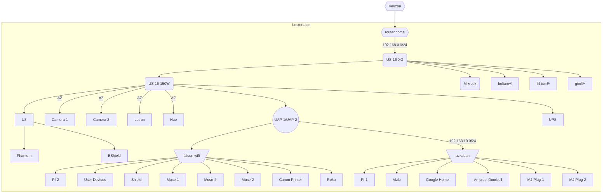

```mermaid
graph TD
    V{{Verizon}} -->PF{{"router.home"}}
    subgraph LesterLabs
        PF  --192.168.0.0/24--> XG(US-16-XG)
        XG --> U16(US-16-150W)
        XG --> M(Mikrotik)
        XG -->He["helium🗄️"]
        XG -->Li["lithium🗄️"]
        XG -->G["gimli🗄️"]
        U16 -->UAP((UAP-1/UAP-2))
        U16--AZ-->C[Camera 1]
        U16--AZ-->C2[Camera 2]
        U16--AZ-->Lu[Lutron]
        U16--AZ-->H[Hue]
        U16-->U8
        U16-->UPS[UPS]
        U8 --> P[Phantom]
        U8-->BSH[BShield]
        UAP--192.168.10.0/24-->AZ[\azkaban/]
        UAP-->FW[\falcon-wifi/]
        FW-->PI2[PI-2]
        FW-->D[User Devices]
        FW-->SH[Shield]
        FW-->M1[Muse-1]
        FW-->M2[Muse-2]
        FW-->M3[Muse-2]
        FW-->Ca[Canon Printer]
        FW-->Ro[Roku]
        AZ-->PI1[PI-1]
        AZ-->VZ[Vizio]
        AZ-->G0[Google Home]
        AZ-->AM[Amcrest Doorbell]
        AZ-->MJ1[MJ-Plug-1]
        AZ-->MJ2[MJ-Plug-2]
    end
```