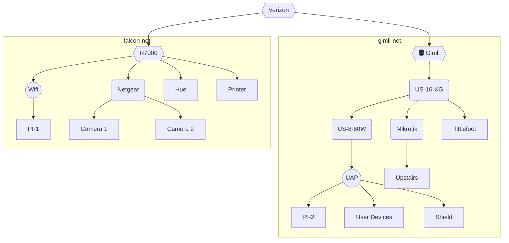

```mermaid
graph TD
    V{{Verizon}} -->G{{fa:fa-database Gimli}}
    V-->R{{R7000}}
    subgraph gimli-net
    G  --> XG(US-16-XG)
    XG --> U8(US-8-60W)
    XG --> M(Mikrotik)
    XG -->L[fa:fa-hdd-o littlefoot]
    U8 -->UAP((UAP))
    UAP-->PI2[PI-2]
    UAP-->D[User Devices]
    UAP-->SH[Shield]
    M--> UP[Upstairs]
    end
    subgraph falcon-net
    R-->N8(Netgear)
    R-->NW((Wifi))
    NW-->PI1[PI-1]
    N8-->C[Camera 1]
    N8-->C2[Camera 2]
    R-->H[Hue]
    R-->B[Printer]
    end
```