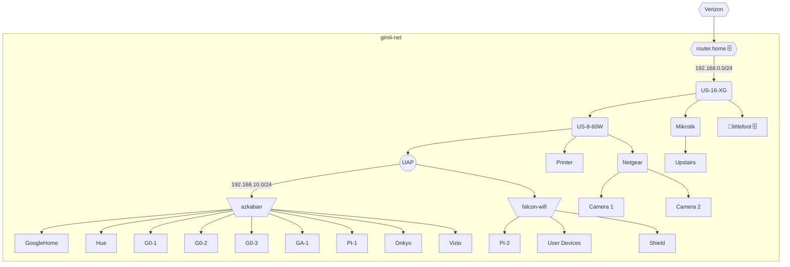

```mermaid
graph TD
    V{{Verizon}} -->G{{"router.home 🗄️"}}
    subgraph gimli-net
        G  --192.168.0.0/24--> XG(US-16-XG)
        XG --> U8(US-8-60W)
        XG --> M(Mikrotik)
        XG -->L["👣littlefoot 🗄️"]
        U8 -->UAP((UAP))
        UAP--192.168.10.0/24-->AZ[\azkaban/]
        UAP-->GW[\falcon-wifi/]
        GW-->PI2[PI-2]
        GW-->D[User Devices]
        GW-->SH[Shield]
        AZ-->G0[GoogleHome]
        AZ-->H[Hue]
        AZ-->G1[G0-1]
        AZ-->G2[G0-2]
        AZ-->G3[G0-3]
        AZ-->G4[GA-1]
        M--> UP[Upstairs]
        U8-->B[Printer]
        U8-->N8(Netgear)
        AZ-->PI1[PI-1]
        AZ-->OY[Onkyo]
        AZ-->VZ[Vizio]
        N8-->C[Camera 1]
        N8-->C2[Camera 2]
    end
```