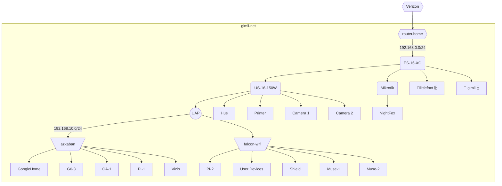

```mermaid
graph TD
    V{{Verizon}} -->PF{{"router.home"}}
    subgraph gimli-net
        PF  --192.168.0.0/24--> XG(ES-16-XG)
        XG --> U8(US-16-150W)
        XG --> M(Mikrotik)
        XG -->L["👣littlefoot 🗄️"]
        XG -->G["🔨 gimli 🗄️"]
        U8 -->UAP((UAP))
        UAP--192.168.10.0/24-->AZ[\azkaban/]
        UAP-->GW[\falcon-wifi/]
        GW-->PI2[PI-2]
        GW-->D[User Devices]
        GW-->SH[Shield]
        AZ-->G0[GoogleHome]
        U8-->H[Hue]
        GW-->M1[Muse-1]
        GW-->M2[Muse-2]
        AZ-->G3[G0-3]
        AZ-->G4[GA-1]
        M--> NF[NightFox]        
        U8-->B[Printer]
        AZ-->PI1[PI-1]
        AZ-->VZ[Vizio]
        U8-->C[Camera 1]
        U8-->C2[Camera 2]
    end
```